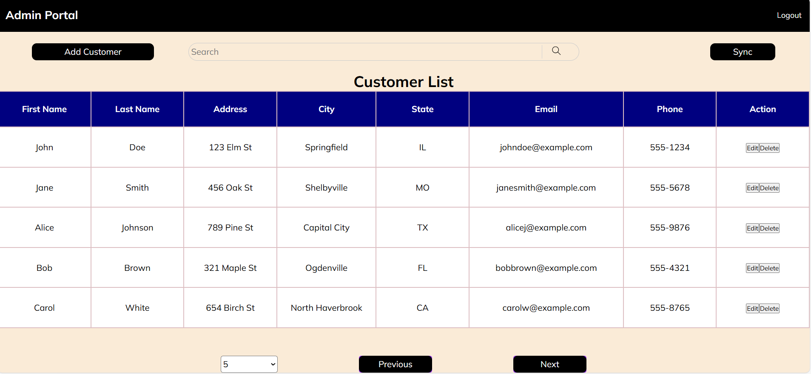
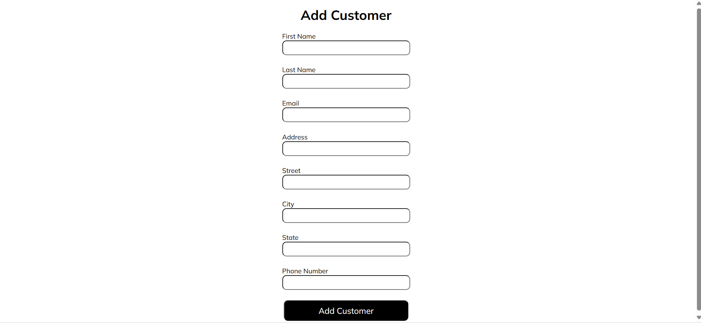

# Customer Management CRUD Application
## Project Description
This is a CRUD (Create, Read, Update, Delete) application for managing customer data. The application includes user authentication using JWT and integrates with a remote API to fetch customer data. The backend is developed using Spring Boot with a MySQL database, while the frontend is built using HTML, CSS, and JavaScript.
The remote server is also created using Spring Boot and runs on port 8082.

## Features
1. **Authentication**
    - Admin login using JWT authentication.
    - Bearer token authorization for subsequent API calls.

2. **Customer Management**

    - Create a new customer.
    - Update an existing customer.
    - Get a list of customers with pagination, sorting, and searching.
    - Get a single customer by ID.
    - Delete a customer.

3. **Sync Functionality**
     - Sync button to fetch and update customer data from a remote API.
## Technologies Used
  - Backend: Spring Boot, MySQL
  - Frontend: HTML, CSS, JavaScript
  - Authentication: JWT (JSON Web Token)

## API Endpoints
### Authentication API
  - **Path:** http://localhost:8080/admin/generateToken
  - **Method:** POST
  - **Request Body:**
      ```json
      {
          "userName": "admin",
          "password": "password"
      }

  - **Response:**
      ```string
        your_token
      ```

### Customer APIs 
- **Create Customer**

    - **Path:** http://localhost:8080/customer/add
    - **Method:** POST
    - **Request Body:**
        ```json
          {
            "firstName": "Jane",
            "lastName": "Doe",
            "street": "Elvnu Street",
            "address": "H no 2",
            "city": "Delhi",
            "state": "Delhi",
            "email": "sam@gmail.com",
            "phone": "12345678"
          }
        
- **Update Customer**
  - **Path:** http://localhost:8080/customer/update
  - **Method:** PUT
  - **Request Body:** Same as the create customer request body.

- **Get All Customer List**
    - **Path:** http://localhost:8080/customer/all
    - **Method:** GET
      
- **Get Customer by Id**
    - **Path:** http://localhost:8080/customer/get/{customerId}
    - **Method:** GET


- **Delete Customer**
    - **Path:** http://localhost:8080/customer/delete/{customerUuid}
    - **Method:** DELETE

- **Sync Customers**
    - **Path:** http://localhost:8080/customer/sync
    - **Method:** POST

- **Get all Customers with Pagination and Sort**
    - **Path:** http://localhost:8080/customer/allWithPagination/{offset}/{pageSize}/{field}
    - **Method:** GET

- **Search Customers by a keyword on all fields**
    - **Path:** http://localhost:8080/customer/search/{offset}/{pageSize}/{keyword}
    - **Method:** GET

## Frontend Screens
1. **Login Screen:** Logn Screen for Admin.
       
    
2. **Customer List Screen:** Displays a list of customers with pagination, sorting, and searching functionalities. Includes a Sync button to fetch and update customer data from a remote API.
       
       
3. **Add Customer Screen:** Form to create a new customer.
       

4. **Update Customer Screen:** Form to edit and update details of customer.
       

## Setup and Installation
### Prerequisites
- Java Development Kit (JDK)
- MySQL Database
- Intellij Idea (to build and run spring boot easily)
- Node.js or Live Server  v5.7.9 extension in VS Code (for running frontend code)
    
### Backend Setup
1. Clone the repository:
   ```bash
        git clone https://github.com/merlin2410/Customer-Crud
2. Configure the MySQL database for CustomerCrud:
    - Create a new database named **customer_db** (In the code it is 'customercrud').
3. Update the **application.properties** file with your MySQL database credentials. For eg.
   
       
           spring.application.name=Assignment
           spring.datasource.url=jdbc:mysql://localhost:3306/customer_db?createTableIfNotExists=true
           spring.datasource.username=root
           spring.datasource.password=password
4. Configure MySQL database for Customer Remote Server:
    - Create a new database named **customerserver**
5. Update the **application.properties file with your MySQL database credentials and change the server port (Eg. In code, it is 8082. Default is 8080)
        spring.application.name=Assignment
        spring.datasource.url=jdbc:mysql://localhost:3306/customerserver?createTableIfNotExists=true
        spring.datasource.username=root
        spring.datasource.password=password
        server.port = 8082
       
6. Build and run both Customer Server and Customer Crud Spring Boot application (use Intellij Idea)
7. Add admin username and password into the database of Customer Crud, which will help you for further login.(Note: Admin creation is not possible via frontend. Use Postman)
   
   - **Path:** http://localhost:8080/admin/generateToken
   - **Method:** POST
   - **Request Body:**
     
          ```json
          {
              "userName": "admin",
              "password": "password",
              "roles": "ROLE_ADMIN"
          }
8. Add admin username and password into the database of Customer Server, which will help you for further login.(Use Postman). Update this credentials into the code of Customer Crud for accessing Customer Server (In RemoteApiService file).
   
   - **Path:** http://localhost:8082/admin/generateToken
   - **Method:** POST
   - **Request Body:**
     
          ```json
          {
              "userName": "admin",
              "password": "password",
              "roles": "ROLE_ADMIN"
          }


### Frontend Setup
1. Open VS Code
2. Navigate to the Frontend directory and open folder
3. Go to **index.html** and using Live Server, run the application.


